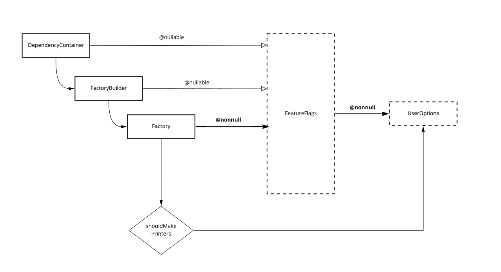
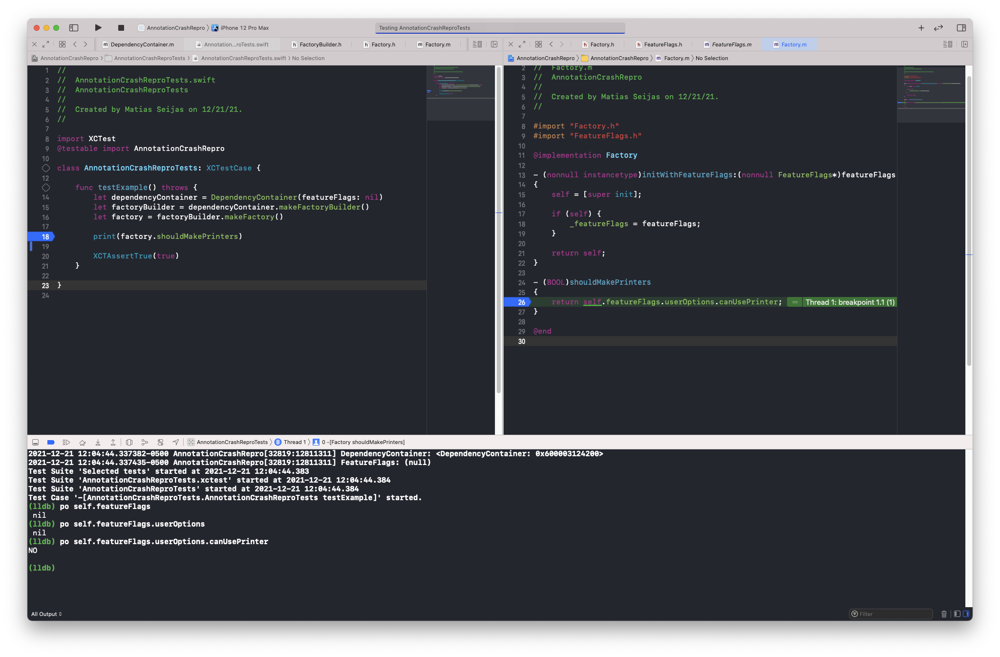

# # AnnotationCrashRepro

## Structure



## Expectation

Accessing `canUsePrinter` should crash due to nullable intermediate objects

```swift
po factory.featureFlags.userOptions.canUsePrinter
```

## Result

Accessing `canUsePrinter` returns `NO` instead


